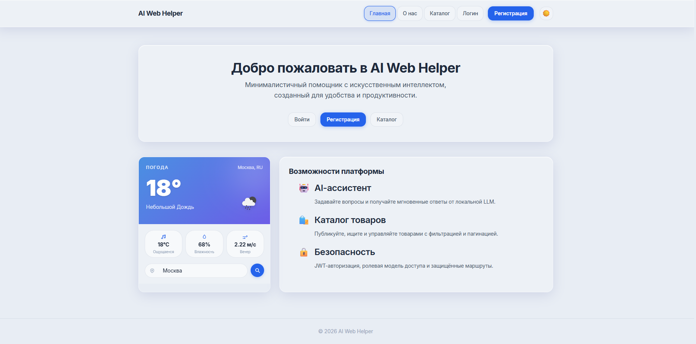
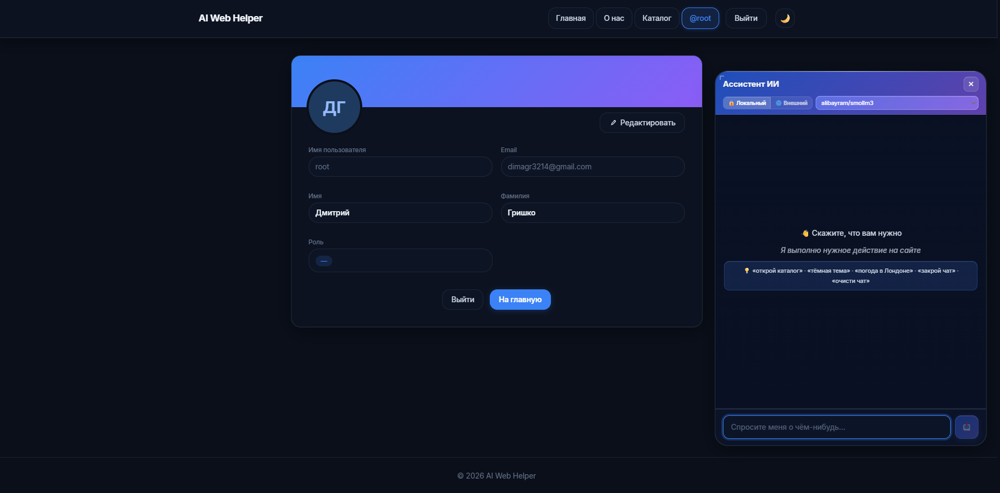

# 🤖 AI Web Helper

> Минималистичный веб-помощник с искусственным интеллектом, системой ролей и современным UI

[](https://reactjs.org/)
[](https://www.djangoproject.com/)
[](https://www.typescriptlang.org/)
[](https://www.docker.com/)
[](LICENSE)

---

## ✨ Возможности

### 🎯 Основные функции

- 🤖 **AI чат-ассистент** - интеграция с Hugging Face моделями
- 👥 **Система ролей** - user / premium / admin
- 📊 **Лимиты запросов** - 10/день для user, ∞ для premium/admin
- 🎨 **Темная тема** - полная поддержка во всех компонентах
- 📱 **Адаптивный дизайн** - mobile / tablet / desktop
- 🔒 **Безопасность** - JWT токены, CSRF защита, permissions

### 👨‍💼 Панель администратора

- Управление пользователями
- Изменение ролей
- Просмотр статистики использования
- Адаптивный дизайн (таблица → карточки)

### 🎨 UI/UX

- Современный минималистичный дизайн
- Плавные анимации и переходы
- Градиентные кнопки
- Динамический header
- Floating chat с изменяемым размером

---

## 🖼️ Скриншоты




---

## 🚀 Быстрый старт

### Предварительные требования

- Docker & Docker Compose
- Порты 80 и 8000 свободны

### Запуск за 5 минут

```bash
# 1. Клонировать репозиторий
git clone <your-repo-url>
cd work

# 2. Запустить контейнеры
docker-compose up --build -d

# 3. Применить миграции
docker-compose exec backend python manage.py migrate

# 4. Создать тестовых пользователей
docker-compose exec backend python create_test_users.py

# 5. Открыть приложение
# Frontend: http://localhost
# Backend API: http://localhost:8000
# Django Admin: http://localhost:8000/admin
```

## 🏗️ Архитектура

```
┌─────────────────────────────────────────────────────────────┐
│                        Frontend (React)                      │
│  ┌──────────────┬──────────────┬───────────────────────┐   │
│  │   Layout     │   Dashboard  │   Admin Panel         │   │
│  │  (Header)    │   (Profile)  │   (User Management)   │   │
│  └──────────────┴──────────────┴───────────────────────┘   │
│  ┌──────────────────────────────────────────────────────┐   │
│  │          FloatingLLMChat (AI Assistant)              │   │
│  └──────────────────────────────────────────────────────┘   │
└───────────────────────┬─────────────────────────────────────┘
                        │ REST API (JWT)
                        ▼
┌─────────────────────────────────────────────────────────────┐
│                     Backend (Django)                         │
│  ┌──────────────┬──────────────┬───────────────────────┐   │
│  │   Users      │   API        │   Permissions         │   │
│  │  (Auth)      │  (LLM)       │  (Role-based)         │   │
│  └──────────────┴──────────────┴───────────────────────┘   │
│  ┌──────────────────────────────────────────────────────┐   │
│  │          UserProfile (Roles & Limits)                │   │
│  └──────────────────────────────────────────────────────┘   │
└───────────────────────┬─────────────────────────────────────┘
                        │
                        ▼
┌─────────────────────────────────────────────────────────────┐
│                  PostgreSQL Database                         │
└─────────────────────────────────────────────────────────────┘
```

---

## 📁 Структура проекта

```
work/
├── backend/                   # Django REST API
│   ├── users/                 # Аутентификация и профили
│   │   ├── models.py          # UserProfile с ролями
│   │   ├── permissions.py     # Кастомные permissions
│   │   ├── views.py           # Admin endpoints
│   │   └── serializers.py     # Сериализаторы
│   ├── api/                   # LLM сервис
│   │   ├── views.py           # API endpoints
│   │   └── llm_service.py     # Hugging Face интеграция
│   └── create_test_users.py   # Скрипт тестовых пользователей
│
├── frontend/                  # React + TypeScript
│   ├── src/
│   │   ├── components/        # React компоненты
│   │   │   ├── layout.tsx     # Header с темной темой
│   │   │   ├── dashboard.tsx  # Профиль пользователя
│   │   │   ├── adminPanel.tsx # Панель администратора
│   │   │   └── floatingLLMChat.tsx  # AI чат
│   │   ├── store/             # Zustand state management
│   │   ├── services/          # API сервисы
│   │   └── style.css          # Глобальные стили + темная тема
│   └── Dockerfile
│
├── docker-compose.yml         # Оркестрация контейнеров
│
└── docs/                      # Документация
    ├── ROLES_SYSTEM.md        # Техническая документация
    ├── ROLES_QUICKSTART.md    # FAQ и руководство
    ├── API_EXAMPLES.md        # Примеры API
    ├── DARK_THEME_GUIDE.md    # Руководство по темной теме
    ├── QUICK_START.md         # Быстрый старт
    └── FINAL_STATUS.md        # Полный статус проекта
```

---

## 🔐 Система ролей

### Три уровня доступа

#### 👤 User (Обычный пользователь)

- ✅ 10 запросов к AI в день
- ✅ Доступ к одной модели
- ✅ Основной функционал

#### 💎 Premium (Премиум пользователь)

- ✅ ∞ Неограниченные запросы
- ✅ Доступ ко всем моделям
- ✅ Приоритетная поддержка

#### 👑 Admin (Администратор)

- ✅ Все права Premium
- ✅ Панель управления пользователями
- ✅ Изменение ролей
- ✅ Просмотр статистики

### Автоматические лимиты

- 📊 Подсчет запросов в реальном времени
- 🔄 Автоматический сброс в полночь (UTC)
- 🚫 Блокировка при достижении лимита
- 📱 Отображение оставшихся запросов в UI

---

## 🛠️ Технологии

### Frontend

- **React 18.3** - UI библиотека
- **TypeScript 5.7** - типизация
- **Vite** - сборщик
- **Tailwind CSS** - стили
- **Zustand** - state management
- **Axios** - HTTP клиент
- **React Router** - маршрутизация

### Backend

- **Django 5.1** - веб-фреймворк
- **Django REST Framework** - API
- **PostgreSQL** - база данных
- **JWT** - аутентификация
- **Hugging Face** - LLM модели

### DevOps

- **Docker** - контейнеризация
- **Docker Compose** - оркестрация
- **Nginx** - frontend сервер
- **Gunicorn** - WSGI сервер

---

## 📡 API

### Аутентификация

```bash
# Регистрация
POST /api/users/register/
Content-Type: application/json
{
  "username": "user",
  "email": "user@example.com",
  "password": "pass123",
  "password2": "pass123"
}

# Логин
POST /api/users/login/
{
  "username": "user",
  "password": "pass123"
}

# Получить профиль
GET /api/users/me/
Authorization: Bearer <token>
```

### LLM сервис

```bash
# Задать вопрос AI
POST /api/llm/ask/
{
  "question": "Что такое Django?",
  "model_name": "alibayram/smollm3"
}

# Ответ
{
  "action_code": "EXPLAIN_CONCEPT",
  "action_description": "Django - это веб-фреймворк...",
  "model_used": "alibayram/smollm3",
  "requests_remaining": 9
}

# Доступные модели
GET /api/llm/models/
```

### Администрирование (только admin)

```bash
# Список пользователей
GET /api/users/admin/users/

# Изменить роль
PATCH /api/users/admin/users/123/role/
{
  "role": "premium"
}
```

---

## 🧪 Тестирование

### Запуск тестов

```bash
# Backend
docker-compose exec backend python manage.py test

# Frontend
docker-compose exec frontend npm test
```

### Создание тестовых данных

```bash
docker-compose exec backend python create_test_users.py
```

---

## 📦 Развертывание

### Development

```bash
# В docker-compose.yml:
DEBUG=True

docker-compose up --build
```

### Production

```bash
# В docker-compose.yml:
DEBUG=False
SECRET_KEY=<your-secret-key>

docker-compose up --build -d
```

---

## 🤝 Вклад в проект

Мы приветствуем вклад! Пожалуйста:

1. Fork репозиторий
2. Создайте feature branch (`git checkout -b feature/AmazingFeature`)
3. Commit изменения (`git commit -m 'Add some AmazingFeature'`)
4. Push в branch (`git push origin feature/AmazingFeature`)
5. Откройте Pull Request

---

## 📝 Лицензия

Этот проект лицензирован под MIT License - см. файл [LICENSE](LICENSE) для деталей.

---

## 📞 Контакты

- **GitHub:** [your-github](https://github.com/TAskMAster339)
- **Email:** dimagr3214@example.com
- **Issues:** [GitHub Issues](https://github.com/TAskMAster339/AI_web_helper/issues)

---

## 🙏 Благодарности

- [Hugging Face](https://huggingface.co/) - за предоставление LLM моделей
- [Django](https://www.djangoproject.com/) - за отличный веб-фреймворк
- [React](https://reactjs.org/) - за мощную UI библиотеку
- [Tailwind CSS](https://tailwindcss.com/) - за современный CSS фреймворк

---

## 📊 Статистика проекта

- **Backend файлов:** 20+
- **Frontend файлов:** 15+
- **Компонентов React:** 10+
- **API endpoints:** 8+
- **Документации:** 8 файлов
- **Строк кода:** 5000+

---

**Сделано с ❤️ AI Web Helper Team**

**Версия:** 1.0.0
**Последнее обновление:** 18 февраля 2026

---

<div align="center">

### 🌟 Поставьте звезду, если проект был полезен! 🌟

</div>
